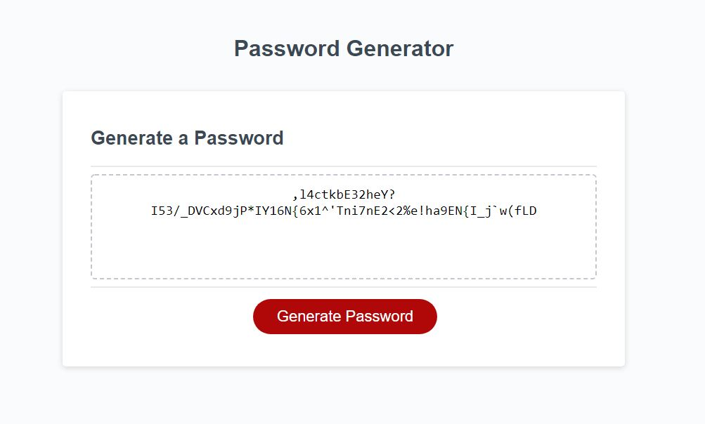

## Password Generator README
### Description
This repository contains code for my password generator assignment. It accepts user input and will generate a random password based on parameters from that input.

The User can input the following parameters to generate a password:

 - Length of password (8-128 characters)
 - If they want to use lowercase letters
 - If they want to use uppercase letters
 - If they would like to use numbers
 - If they would like to use special characters

Code used in this Repo:
 - HTML
 - CSS
 - JavaScript

### Links
 - [GitHub Repo](https://github.com/Jacee94/password-generator)
 - [Deployed Application](https://jacee94.github.io/password-generator/)

### Snapshot
